# CodeKosh

CodeKosh is a modern, developer-focused mobile application built with Expo, React Native, and TypeScript. It serves as an offline-first code vault, allowing developers to save, organize, manage, and understand code snippets directly on their devices.

[](https://drive.google.com/file/d/1gMo8e8M11rhO02alnk5WdhlnMoJF7ele/view?usp=drivesdk)

## Core Features

### 1. Snippet Management
- Full CRUD: Create, edit, and delete code snippets with ease.
- Rich Metadata: Each snippet supports a title, description, programming language, and custom tags.
- Organization: Efficiently browse and search through your collection using titles, languages, or tags.
- Favorites: Mark your most important snippets as favorites for quick access in a dedicated screen.

### 2. Offline-First Architecture
- SQLite Database: Core data persistence is handled by a robust local SQLite database.
- Total Offline Access: Create, edit, search, and view snippets without any internet connection.
- Data Integrity: Uses relational tables with foreign key constraints to manage snippet attachments.

### 3. File Management
- Local Vault: Built using Expo FileSystem for a native file management experience.
- Attachments: Attach screenshots, PDFs, or source files directly to your snippets.
- File Browser: Browse, view, and manage stored files within the app.
- Local Storage: Save snippets as physical code files on your device's filesystem.

### 4. AI Code Assistant
- Real-time Explanations: Powered by Mistral AI to provide deep insights into your code.
- Summaries & Suggestions: Get concise summaries and improvement suggestions for any snippet.
- Streaming Interface: A responsive chat-like experience for interacting with the AI.

### 5. Export & Sharing
- Universal Sharing: Share code snippets directly to other applications.
- File Export: Export snippets as .txt, .js, .ts, and more.
- Local Persistence: Save exported files directly to the device's storage.

---

## Technical Implementation

### Database Structure
The app utilizes SQLite (expo-sqlite) for relational data storage:
- snippets Table: Stores metadata including id, title, description, code, language, tags (JSON), isFavorite, and timestamps.
- snippet_attachments Table: Manages file attachments with columns for name, uri, type, and size, linked via snippetId with ON DELETE CASCADE.

### Offline Storage Strategy
- Primary Store: SQLite handles all structured snippet and attachment data.
- Preferences: AsyncStorage is used for non-sensitive application state like themes.
- Security: Sensitive data and API configurations are managed via environment variables and secure practices.
- Migration Path: The app includes a robust migration service (DatabaseInitService) that handles schema updates and legacy data migration from AsyncStorage to SQLite.

### File Management Implementation
Using Expo FileSystem, CodeKosh creates a dedicated directory structure for each snippet. This ensures that:
- Files are isolated and organized.
- Deleting a snippet automatically cleans up its associated physical files.
- Users can preview attachments (PDFs, Images, Code) directly within the app.

### AI Integration Workflow
CodeKosh uses Expo Router API Routes to proxy requests to the Mistral AI API:
1. Request: The client sends the snippet and user query to /api/chat.
2. Context: The server injects the snippet code and language into a system prompt for the AI.
3. Streaming: The response is streamed back to the AiAssistant component using a ReadableStream, providing a fast and interactive UX.

---

## Getting Started

### Prerequisites
- Node.js (v18+)
- Expo Go app on your mobile device or an Emulator (Android/iOS)

### Installation
1. Clone the repository
2. Install dependencies:
   ```bash
   npm install
   ```
3. Create a .env file based on .example.env and add your MISTRAL_API_KEY.
4. Start the application:
   ```bash
   npx expo start
   ```

---

## Screenshots
<div style="display: flex; flex-wrap: wrap; gap: 5px;">
  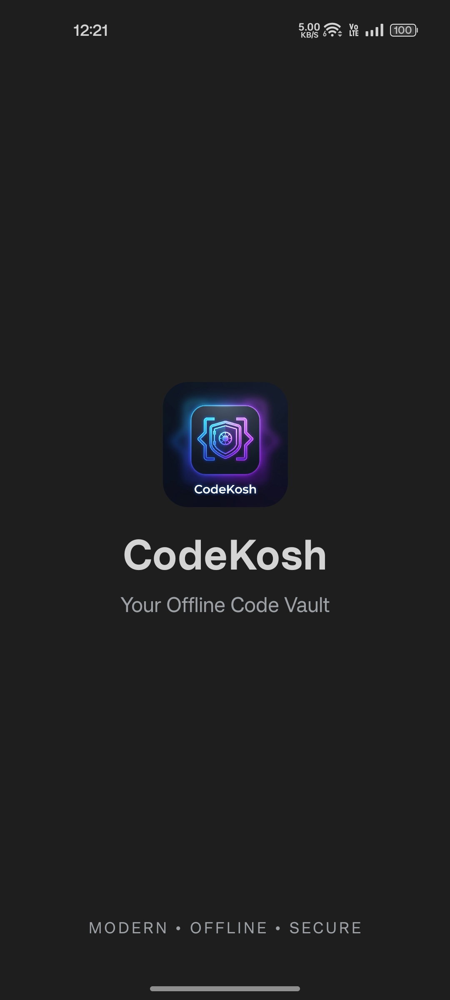
  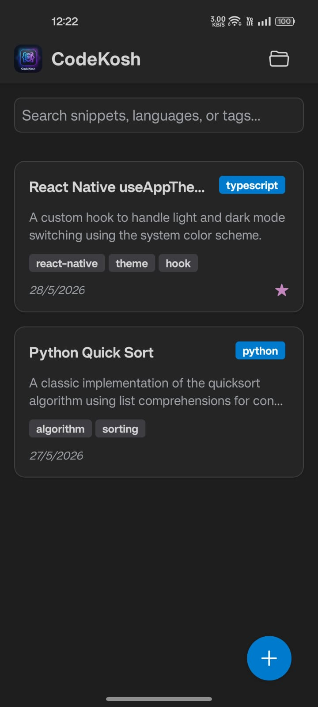
  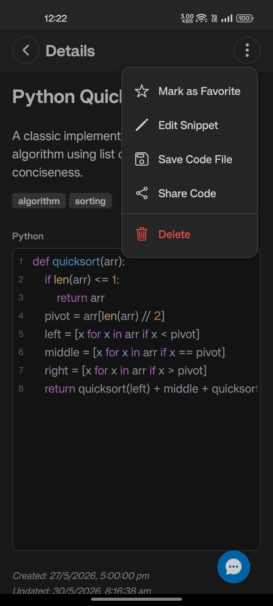
  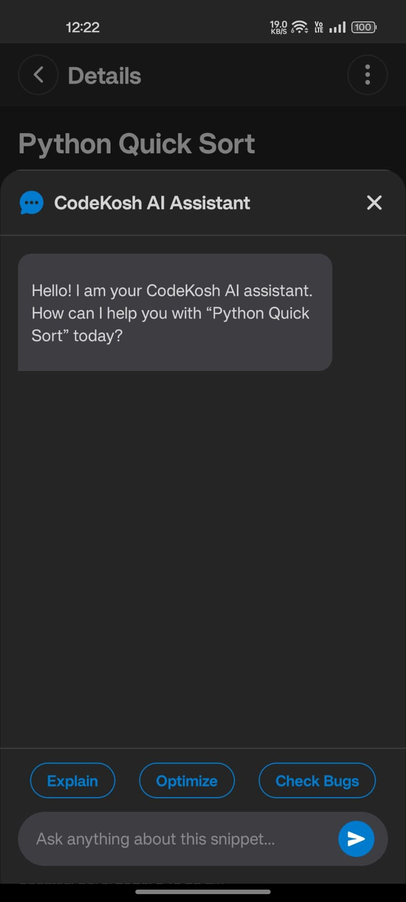
  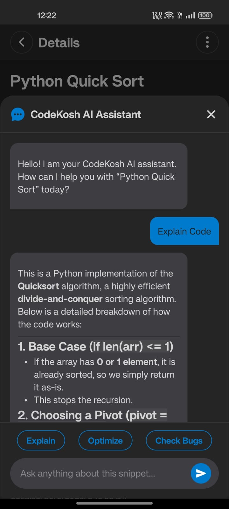
  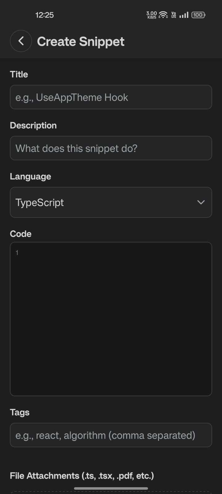
  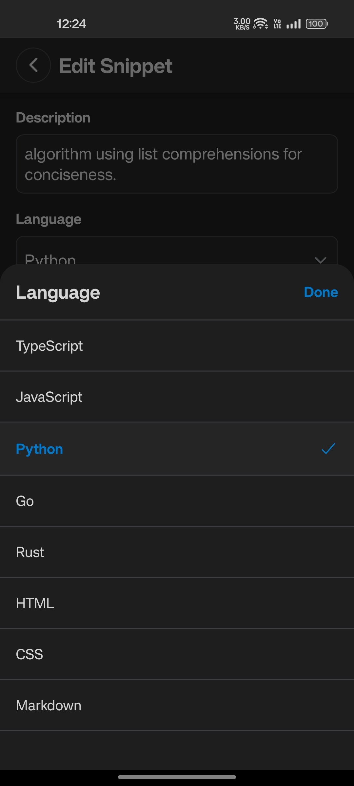
  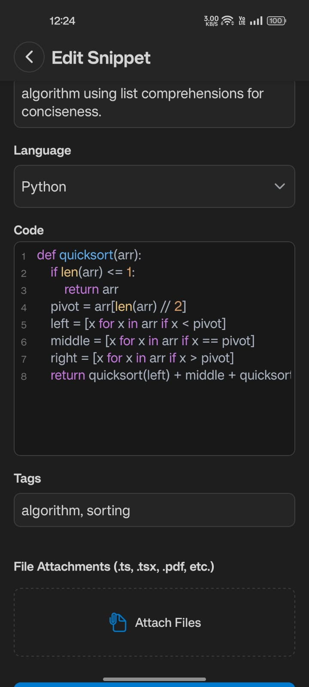
  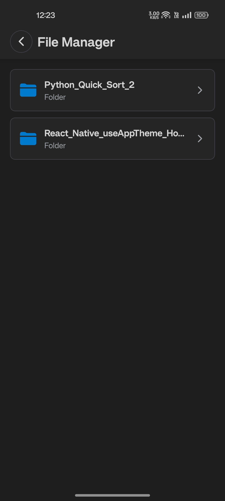
  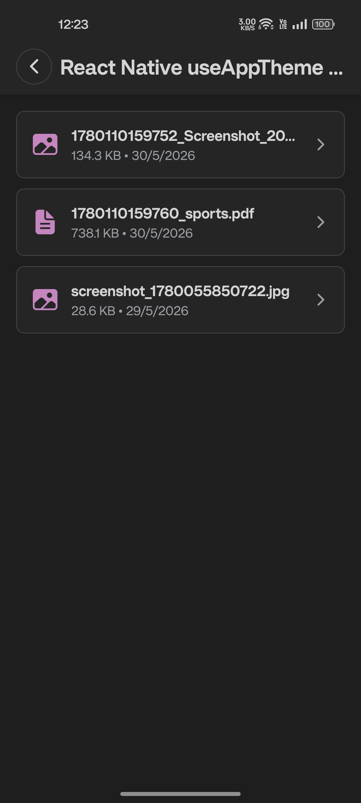
  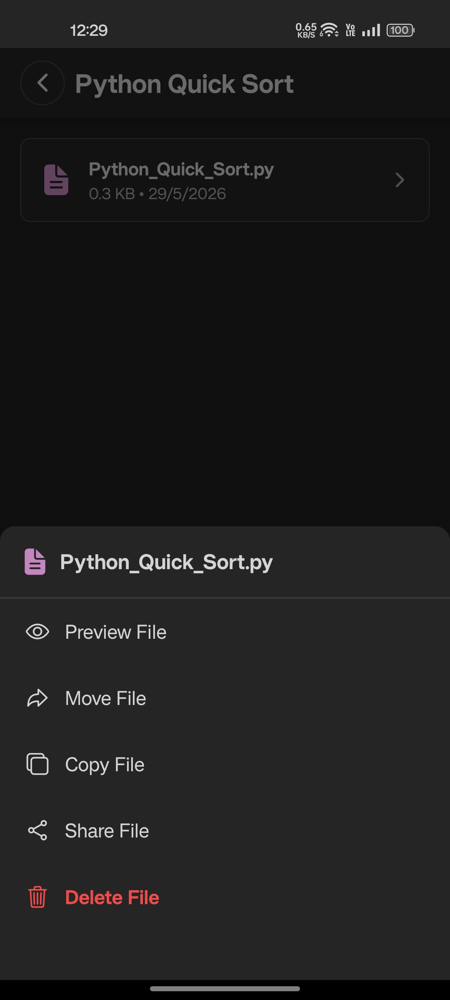
  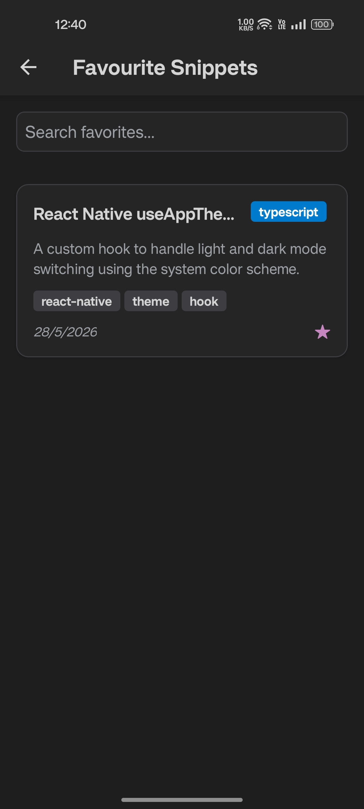
</div>

---