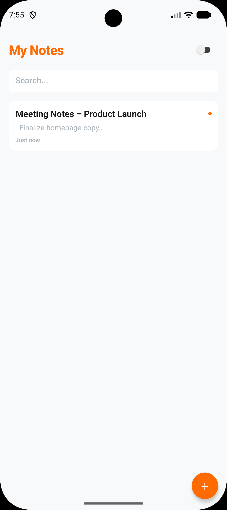
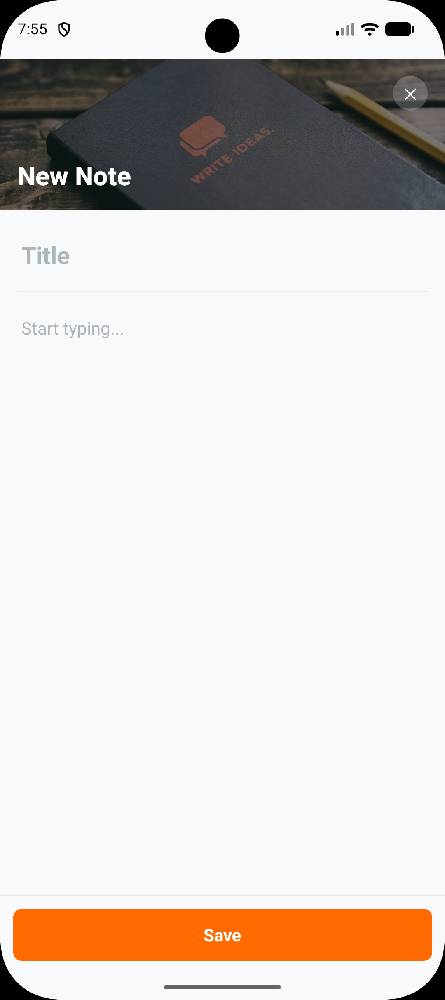
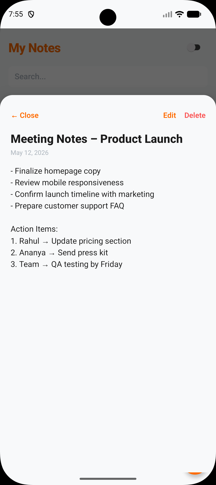
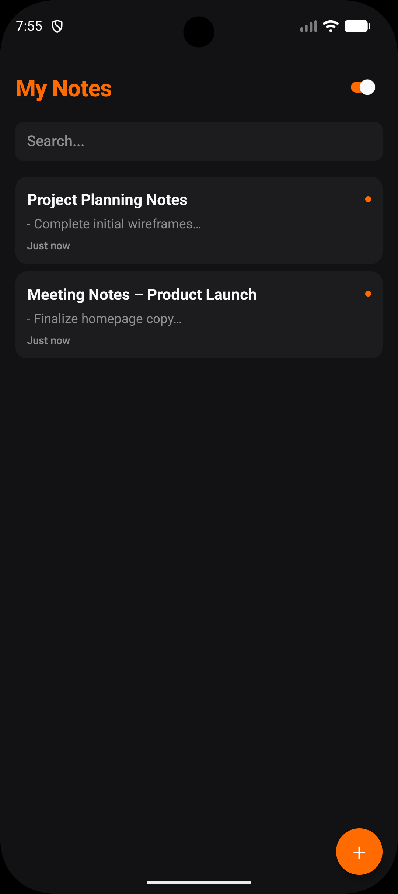
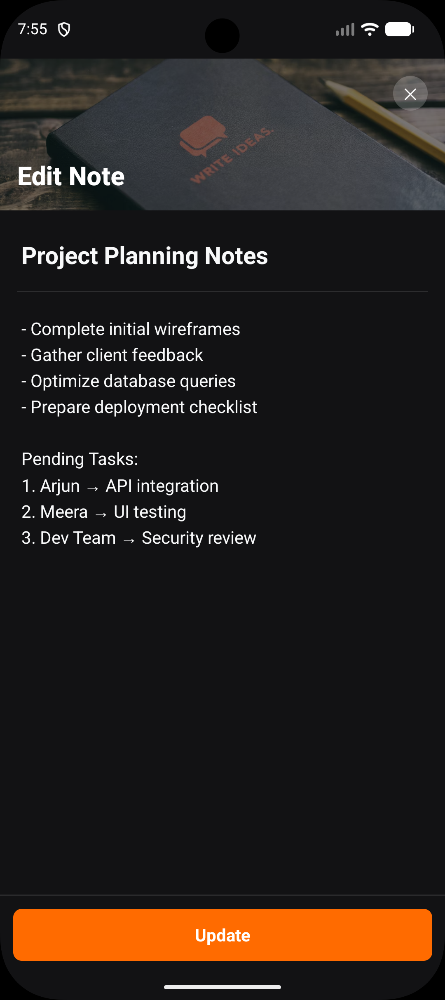
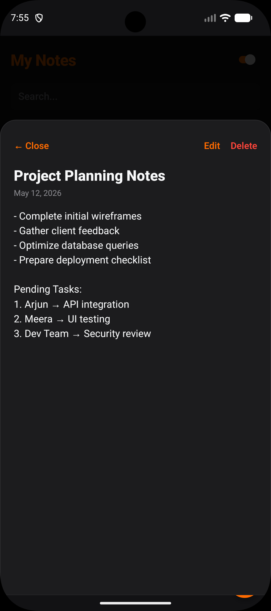

# Notes App

A sleek, modern, and high-density Notes application built with React Native and Expo. Notes app features a premium "Black & Vibrant Orange" aesthetic, designed for speed and productivity.

## Demo

Check out the application in action:

[](https://raw.githubusercontent.com/PankajKumar1947/mobile-dev-assignment/main/notes-app/demo/demo.mp4)

## Features

- **Full CRUD Functionality**: Create, read, update, and delete notes seamlessly.
- **Modern Aesthetics**: A minimal, premium UI with a custom design system.
- **Smart Search**: Quickly filter through your notes with real-time search indexing.
- **Dynamic Theming**: 
  - Automatic system theme detection using useColorScheme.
  - Manual toggle for Light/Dark mode.
  - Transparent, theme-aware Status Bar integration.
- **Responsive Layout**:
  - **Phone**: Optimized single-column high-density list.
  - **Tablet**: Automatic 2-column grid layout using useWindowDimensions.
- **Live Relative Time**: Notes display relative timestamps (e.g., "2m ago") for a modern feel.
- **Premium Interactions**: Custom modal "bottom sheets" and tactile press animations.

## Tech Stack

- **Framework**: React Native with Expo (Router SDK 50+)
- **State Management**: React Context API (Modularized into Note & Theme contexts)
- **Styling**: Pure StyleSheet with advanced flatten and compose patterns.
- **Safe Area Handling**: Integrated react-native-safe-area-context for edge-to-edge displays.

## Project Structure

```text
src/
├── app/               # Expo Router entry points
├── components/        # Modular UI components (NoteCard, NoteEditor)
├── context/           # Decoupled state management (Notes, Theme)
├── theme/             # Centralized design tokens and colors
├── types/             # TypeScript models and input definitions
└── utils/             # Helper functions (Date formatting, etc.)
```

## Screenshots

### Light Mode & High-Density Layout
| | | |
|:---:|:---:|:---:|
|  |  |  |

### Dark Mode & Premium Aesthetic
| | | |
|:---:|:---:|:---:|
|  |  |  |

## Getting Started

1. **Install dependencies**:
   ```bash
   npm install
   ```

2. **Start the development server**:
   ```bash
   npx expo start
   ```

3. **Run on your device**:
   Scan the QR code with the Expo Go app (Android) or Camera app (iOS).

---

Built for a modern note-taking experience.
