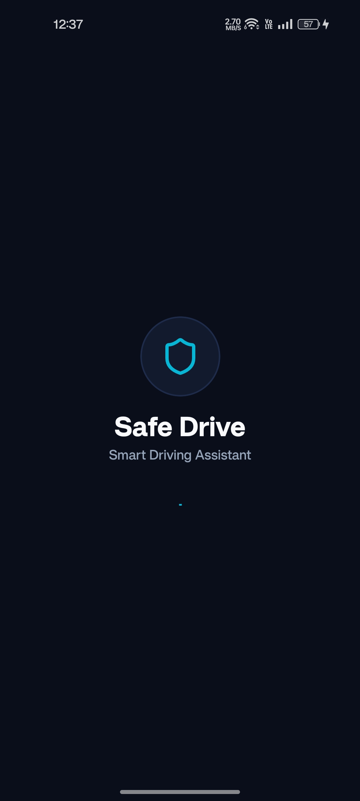
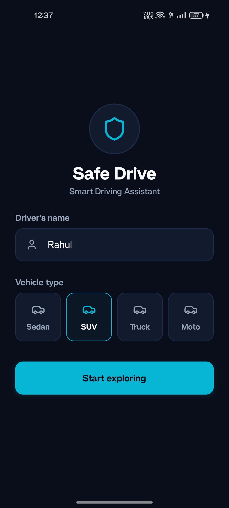
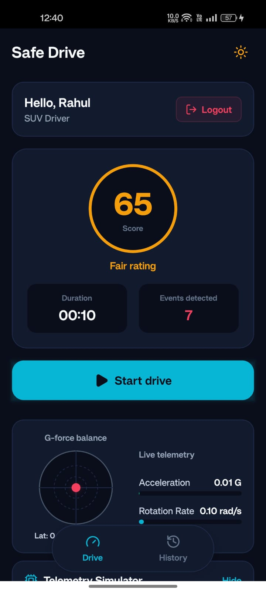
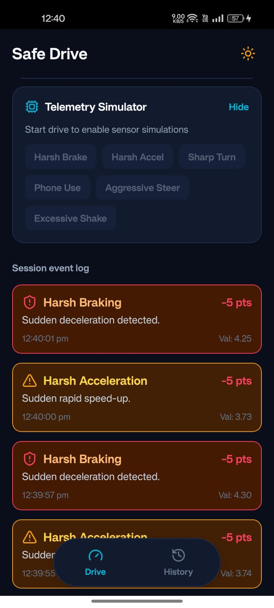
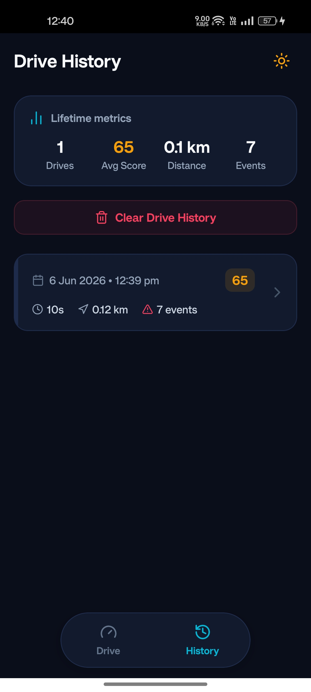
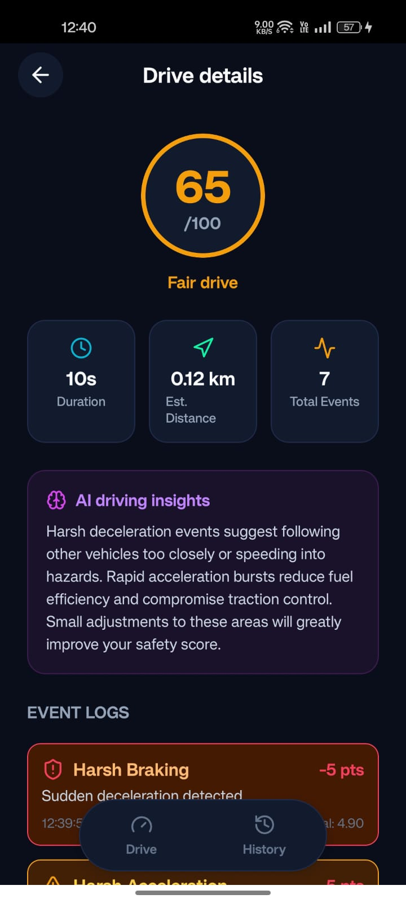
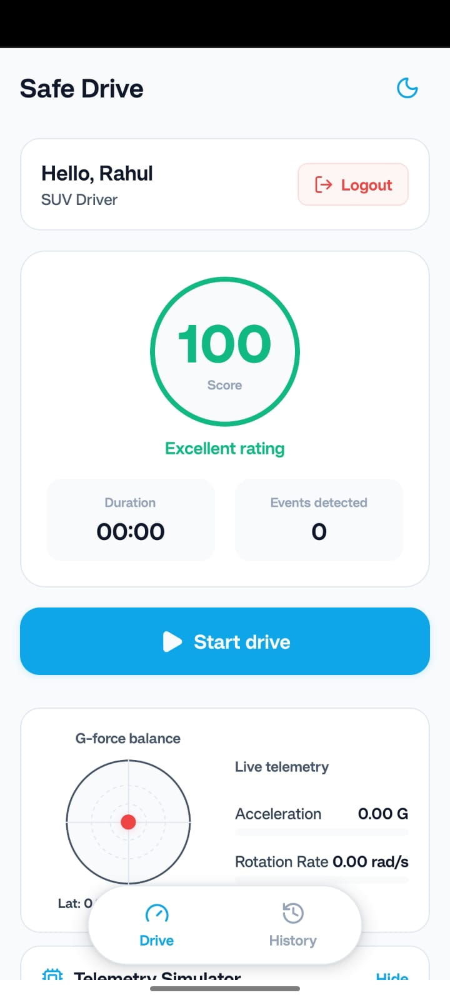
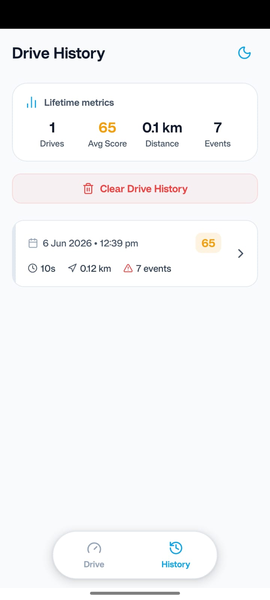
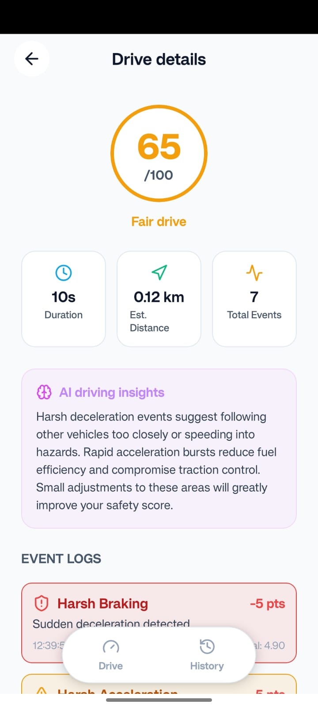

# Safe Drive – Driver Distraction & Harsh Driving Detection System

**Safe Drive** is a mobile application built using React Native and Expo designed to analyze driving behavior in real-time. By leveraging mobile device sensors (Accelerometer & Gyroscope), the application detects driving hazards such as harsh braking, sudden acceleration, sharp turns, phone distraction, and excessive movement to calculate a driving safety score and provide AI-generated feedback.

## Screenshots

<div style="display: flex; flex-wrap: wrap; justify-content: center; align-items: center; gap: 6px;">
  
  
  
  
  
  
  
  
  
</div>

---

## Features & UX Highlights

1. **Dashboard & Drive Tracker**:
   - **Real-Time Sensor Telemetry**: A live G-force balance chart and rotation rate progress bar map accelerometer and gyroscope states.
   - **Interactive Telemetry Simulator**: Inject mock hazard events to test scoring deductions and log triggers directly on simulators.
   - **Drive Session Control**: Easily start and end drive sessions to collect session data.
2. **Dynamic Light & Dark Theme**:
   - Obsidian-cobalt neon theme for dark mode and soft slate theme for light mode.
   - Persisted theme settings using `AsyncStorage`.
   - Access toggle directly in the top-right navigation header.
3. **Pill Navigation Bar**:
   - Clean, centered tab bar with layout margins that avoids full-width clutter and feels premium.
4. **Historical Insights**:
   - Lifetime metrics (total drives, average score, distance, and total events).
   - Clear history functionality with confirmation alerts.
   - Full scrollable list of historical sessions.
5. **Standalone Drive Details Screen**:
   - Interactive breakdown of unsafe events.
   - AI-generated driving insights feedback based on session severity.
   - Event timeline log that scrolls completely without clipping behind the bottom tab bar.

---

## Tech Stack

- **Core**: React Native (Expo v55, Expo Router v3)
- **Language**: TypeScript
- **Styling**: Vanilla React Native `StyleSheet` with dynamic theme context provider
- **Storage**: `@react-native-async-storage/async-storage` for profiles, drive sessions, and settings persistence
- **Icons**: `lucide-react-native`

---

## Sensors & Event Detection Strategy

The app utilizes **Accelerometer** and **Gyroscope** data samples to detect driving behavior:

1. **Filtering & Preprocessing**:
   - Magnitude calculations ($|v| = \sqrt{x^2 + y^2 + z^2}$) are performed on raw linear acceleration (excluding gravity) and rotation rates to normalize multi-axis motion.
   - A low-pass filter (LPF) is used to smooth transient spikes and isolate gravity vector components.
2. **Event Cooldowns**:
   - A **3-second cooldown** is enforced per hazard type to prevent duplicate event triggers from the same continuous motion.

### Detection Thresholds & Deductions

| Event Type | Sensor Condition | Score Deduction | Severity |
| :--- | :--- | :---: | :---: |
| **Harsh Acceleration** | Acceleration $> 3.0 \, m/s^2$ (when steering is stable) | `-5` | Medium |
| **Harsh Braking** | Acceleration $> 3.9 \, m/s^2$ | `-5` | High |
| **Sharp Turn** | Acceleration $> 3.4 \, m/s^2$ AND Gyroscope $> 0.5 \, rad/s$ | `-3` | Medium |
| **Aggressive Steering** | Gyroscope $> 0.8 \, rad/s$ | `-3` | Low |
| **Phone Handling** | Gyroscope $> 1.2 \, rad/s$ AND Acceleration $< 2.5 \, m/s^2$ | `-10` | High |
| **Excessive Device Movement** | Acceleration $> 4.5 \, m/s^2$ AND Gyroscope $> 1.5 \, rad/s$ | `-5` | Low |

---

## Driving Score & Safety Ratings

Each drive session begins with a base score of **`100`**. Points are subtracted dynamically as hazard events are triggered during the session (bottoming out at `0`):

- **Final Score**: $\max(0, 100 - \sum \text{Deductions})$
- **Safety Ratings**:
  - `Score >= 90`: **Excellent** rating (Green)
  - `Score >= 75`: **Good** rating (Cyan)
  - `Score >= 60`: **Fair** rating (Amber)
  - `Score < 60`: **Unsafe** rating (Red)

---

## How to Run Locally

### Prerequisites
- Node.js (v18+)
- Expo Go app on a physical device, or Android Emulator / iOS Simulator configured on your machine.

### Installation
1. Clone this repository and navigate to the project directory:
   ```bash
   cd safedrive
   ```
2. Install dependencies:
   ```bash
   npm install
   ```
3. Start the application:
   ```bash
   npm start
   ```
4. Scan the QR code shown in the terminal using the **Expo Go** app, or press `a` (Android) / `i` (iOS) to load the app in the simulator.

---

## Assumptions & Considerations

- **Device Placement**: The detection algorithm assumes that the device is relatively secure (e.g., inside a car mount or console slot). If the phone slides off the seat, it will trigger an **Excessive Device Movement** warning.
- **Phone Handling Distinction**: Phone handling is identified when there is significant rotational rate change (gyroscopic movement) but minimal overall vehicle acceleration change, suggesting the driver is interacting with the device directly.
- **Battery Efficiency**: Sensor sample rates are optimized to query at 10Hz to prevent battery drain while remaining highly responsive to rapid maneuvers.
