# Streakly: A Reactive Mobile Habit Tracker

Streakly is a premium, feature-rich React Native mobile application built with Expo, designed to help users establish and maintain habits (such as Drink Water, Code 1 Hour, Read, or Workout). The application features advanced local scheduling, server-side push notification integration, robust streak tracking, and interactive deep-linking capabilities.

---

## Screenshots

Here is a visual overview of the Streakly mobile app:

<div style="display: flex; flex-wrap: wrap; gap: 8px; justify-content: flex-start;">
  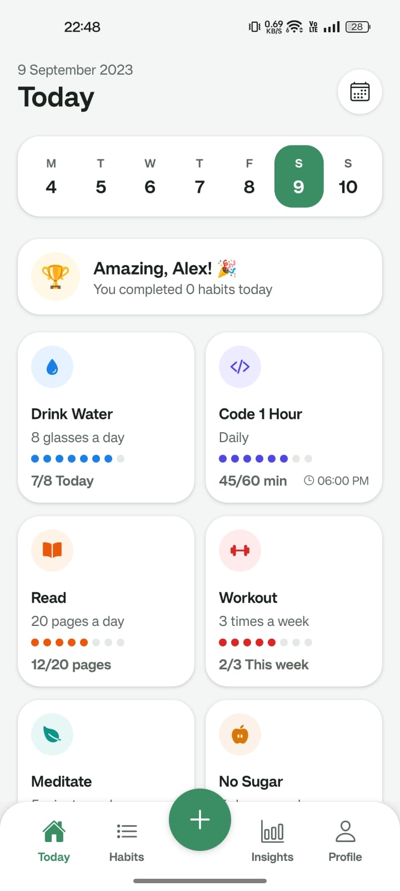
  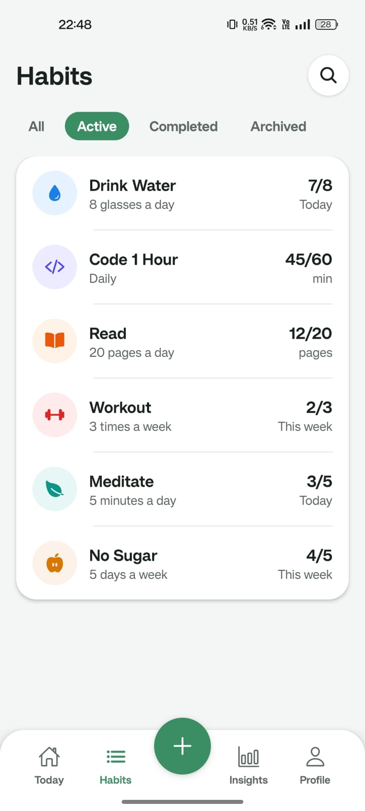
  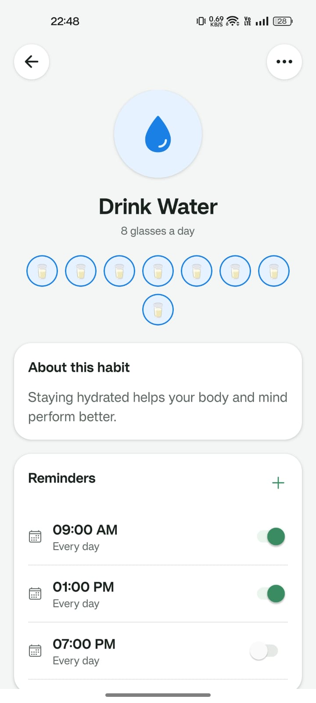
  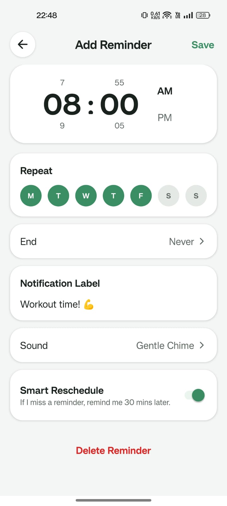
  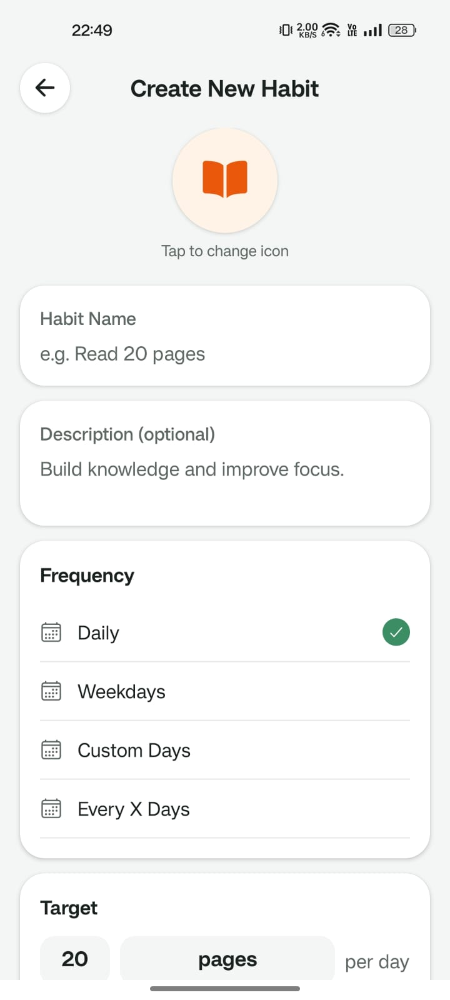
  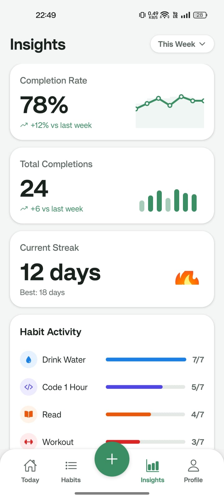
  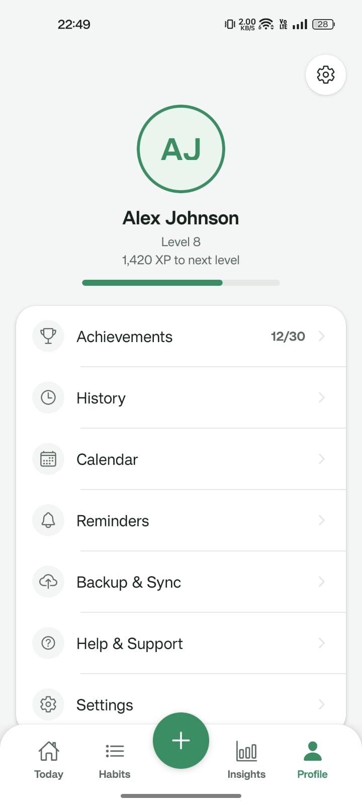
  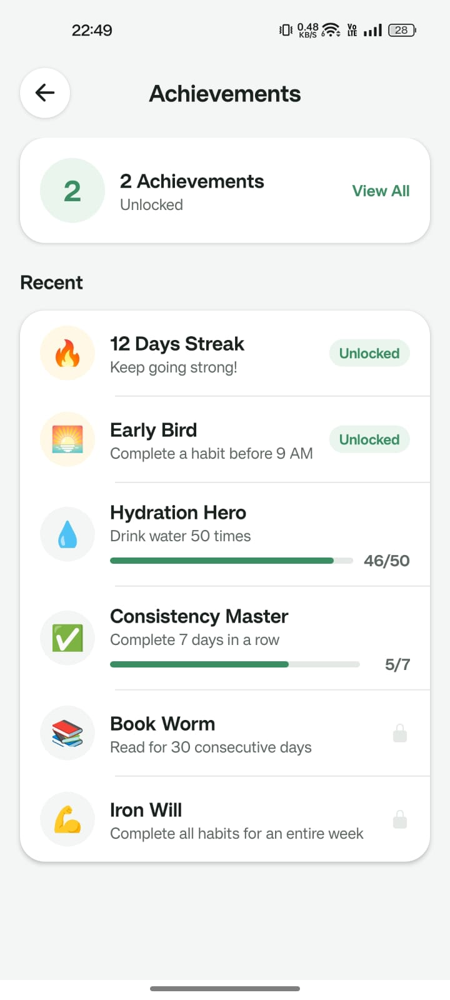
  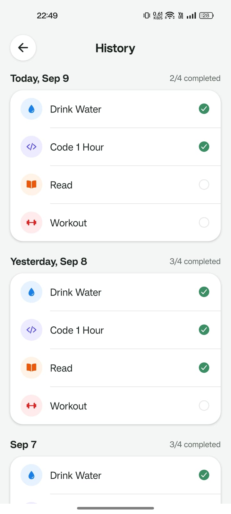
  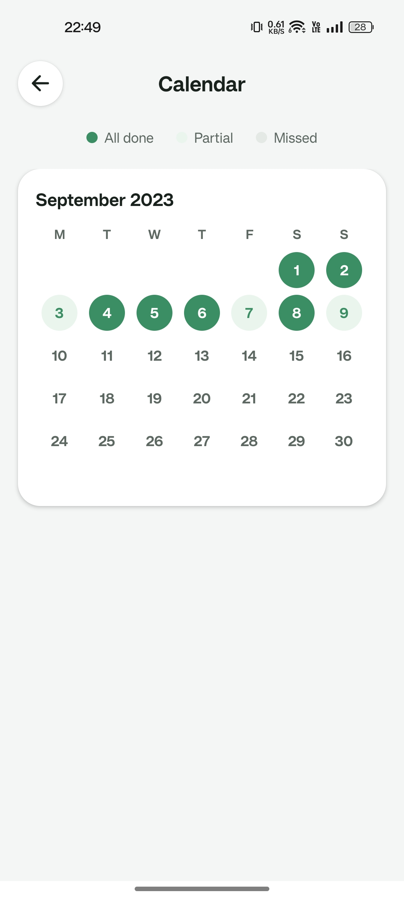
  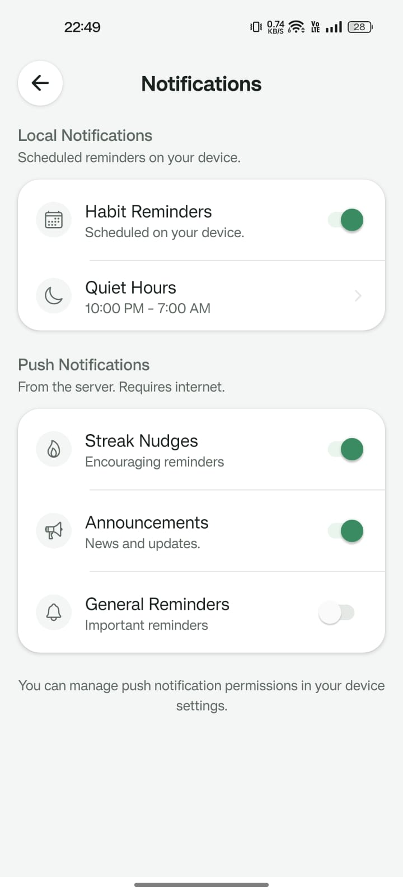
  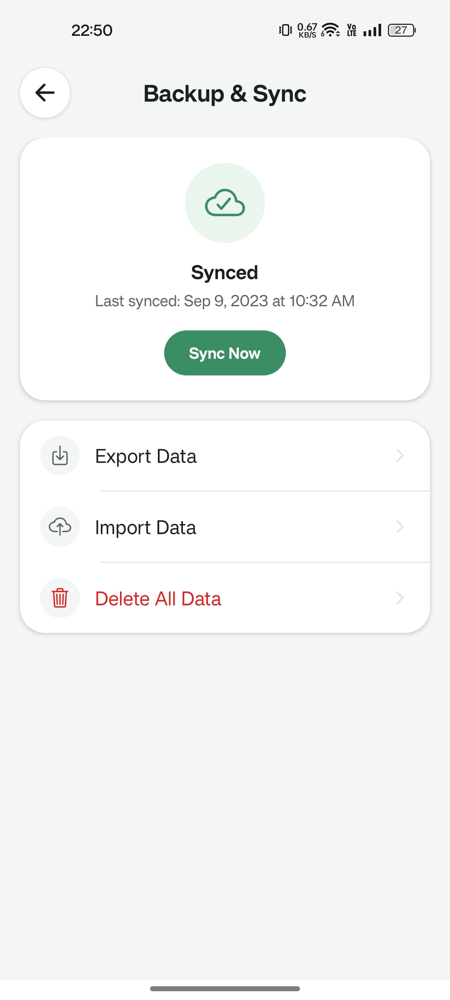
  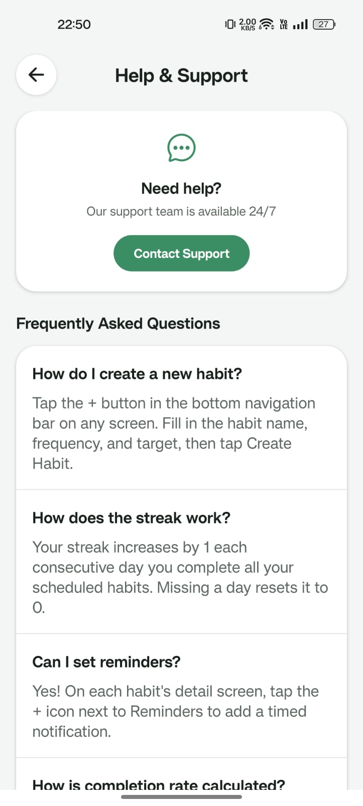
  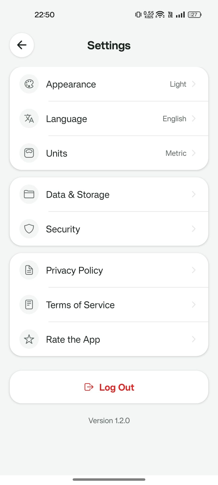
</div>

---

## Features and Core Functionality

1. **Habit CRUD and State Persistence**
   - Create, edit, and delete habits with customizable names, icons, frequencies, and target completions.
   - Frequency support for both daily reminders and weekly reminders (on selected weekdays).
   - Entire habit state and scheduled notification IDs are persisted locally across app restarts.

2. **Streak Tracking and Reset Logic**
   - Marking a habit as completed today increases or maintains the streak.
   - Missing a scheduled completion date resets the streak.
   - Real-time streak statistics and calendar visualizers are presented to the user.

3. **Intelligent Notification Routing**
   - **Local Notifications**: Automatic, offline scheduling of habit reminders according to frequency.
   - **Push Notifications**: Multi-purpose notifications (streak nudges, announcements, habit reminders) pushed from a server.
   - **Unified Tap Handling and Deep Linking**: Universal handler routes both local and push notification taps directly to specific habit detail screens using the Expo Router protocol.

---

## Notification Architecture and Conceptual Design

### 1. Local vs. Push Notifications
* **Local Notifications**: Scheduled directly by the client app on the device's operating system. They run completely offline without server interaction.
  * *When to use*: Best for user-defined events, calendar schedules, and recurring task reminders (e.g., Drink Water every day at 2 PM) where network connectivity is not required.
* **Push Notifications**: Initiated by a remote backend server, sent via the Expo Push Service, and delivered through APNs (Apple) or FCM (Android) to the target device.
  * *When to use*: Best for server-driven events, social nudges, announcements, updates calculated on a server (e.g., "Your friend completed their goal!"), or synchronized multi-device alerts.

### 2. Expo Push Tickets vs. Push Receipts
* **Push Ticket**: Generated immediately by the Expo Push Service when the backend server posts a message payload. It indicates that Expo has received and validated the format of the payload and successfully queued it. A ticket contains a `receiptId` if the request was accepted.
* **Push Receipt**: Generated after Expo attempts to hand off the notification to Apple's APNs or Google's FCM. It indicates whether the delivery to the native push service succeeded or failed, containing error diagnostics (such as `DeviceNotRegistered`) if the handoff failed.

### 3. Handling DeviceNotRegistered
* The `DeviceNotRegistered` error indicates that the target Expo Push Token is no longer active (e.g., the user uninstalled the app or revoked notification permissions).
* **Server Action**: The backend server must actively check the push receipts, inspect for the `DeviceNotRegistered` error code, and immediately **delete or mark that push token as inactive** in the database to prevent sending subsequent failed payloads (saving network overhead and preventing rate limiting).

### 4. Expo Go Limitations
* **Push Notifications** and custom background notification triggers do not work out of the box in the standard Expo Go client because it is a shared sandbox.
* **Solution**: You must create a **Development Build** (`npx eas build` or native local build) to bundle the required native credentials, notification certificates, and custom configuration plugins.

### 5. Android Notification Channels
* **Importance**: Android 8.0 (API level 26) and above requires all notifications to be assigned to a specific channel. If no channel is defined, the system cannot post the notification.
* **Pre-request Requirement**: The custom channel must be created **before** requesting notification permissions. This ensures that the OS has the channel registered with its designated priority, sound, and visual styling. When the permission is granted, notifications can be routed instantly to the high-importance channel to display banners and play sound.

---

## Folder Structure and Architecture

All notification side-effects are decoupled from UI components and centralized under the `src/lib/notifications/` workspace.

```text
src/
├── app/                      # Expo Router App Screens
│   ├── (tabs)/               # Bottom Tab Screens (Today, Habits, Insights, Profile)
│   │   ├── index.tsx         # Today's Habits List and Streak Banner
│   │   └── habits.tsx        # Habits Management List
│   ├── habit/
│   │   └── [id]/             # Habit Details, Edit, and Reminders
│   └── profile/
│       └── notifications.tsx # Permissions Status and Push Config
├── components/               # Premium Custom Reusable UI Components
├── hooks/
│   ├── query/                # Data Fetching Hooks
│   │   └── use-habits.ts     # Habits State Querying Hook
│   └── use-notifications.ts  # Notifications Hook (Registers, listens, schedules)
├── lib/
│   └── notifications/        # Notification Engine
│       ├── setup.ts          # Android channel config, foreground handler, initializers
│       ├── schedule.ts       # Local reminder scheduling, cancels, edits
│       └── push.ts           # Token registration, clipboard utilities
└── theme/                    # HSL and Color Token Design System
```

---

## Getting Started

### 1. Installation
Install the project dependencies using your preferred package manager:
```bash
npm install
# or
bun install
```

### 2. Running Locally (Expo Go Simulator)
To run the app on an emulator/simulator with local notifications support:
```bash
npx expo start
```

### 3. Creating a Development Build
To test server-side push notifications, you need to compile a custom development client:
```bash
# Log in to your Expo account
npx eas login

# Run development build configuration
npx eas build --profile development --platform android
# or
npx eas build --profile development --platform ios
```

---

## Universal Deep Link Payload Contract

Both local and push notifications use the following JSON payload contract to enable seamless routing to the details page:

```json
{
  "to": "ExponentPushToken[xxxxxxxxxxxxxxxxxxxxxx]",
  "title": "Time to drink water",
  "body": "Keep up your 5-day streak!",
  "data": {
    "screen": "/habit",
    "habitId": "1"
  }
}
```
* **Tap Handler Action**: Decodes the `data` properties and utilizes `router.push({ pathname: "/habit/[id]", params: { id: habitId } })` to perform the deep link.


